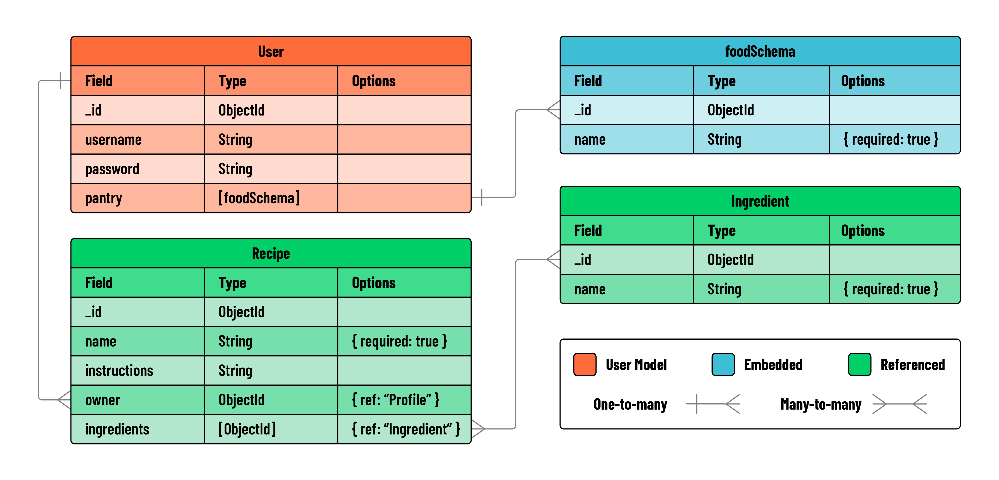

Referencing Data
In this lab, the Recipe model will reference the Ingredient model using an array of ObjectIds. Each recipe will be associated with a User, thereby creating a relationship between users and their collections of recipes and ingredients.

You will be referencing the Recipe schema within the User schema, establishing a one-to-many relationship

You will be referencing the Ingredient schema within the Recipe schema, establishing a many-to-many relationship

Recipe routes
Action Route HTTP Verb
Index /recipes GET
New /recipes/new GET
Create /recipes POST
Show /recipes/:recipeId GET
Edit /recipes/:recipeId/edit GET
Update /recipes/:recipeId PUT
Delete /recipes/:recipeId DELETE

Ingredient routes
Action Route HTTP Verb
Index /ingredients GET
New /ingredients/new GET
Create /ingredients POST
Show /ingredients/:ingredientId GET
Edit /ingredients/:ingredientId/edit GET
Update /ingredients/:ingredientId PUT
Delete /ingredients/:ingredientId DELETE

When using certain methods e.g
const User = await User.findOne({email});
if(!User){ //create a new user }
The condition isn’t checking for a Boolean — it’s checking whether a document was found (truthy) or not (falsy).
That method can either provide a true/false or underfined. Be careful of this.
